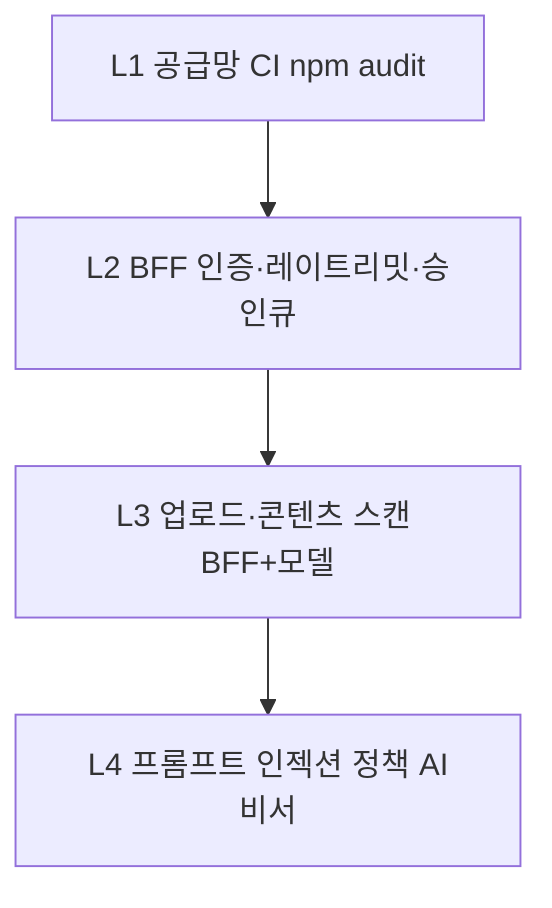

# AI 보안(백신) · 보안 업데이트 기획

Yuhan Suite 통합 웹앱과 BFF에 **위협 완화·공급망·운영 패치**를 체계적으로 넣기 위한 기획입니다. 구현 상태는 웹 [`/suite/ai-security`](../../apps/web/src/pages/suite/AiSecurityHubPage.tsx) 허브와 본 문서를 기준으로 합니다.

## 1. 목표

| 목표 | 설명 |
|------|------|
| **AI 백신(개념)** | 전통 백신이 아니라 **다층 방어**: 의존성 취약점, 업로드·프롬프트 위험, API 남용, 설정 표준화 |
| **보안 업데이트** | 주기적 `npm audit`, 패치 윈도우, [SECURITY_IMPROVEMENT_PLAN.md](./SECURITY_IMPROVEMENT_PLAN.md) Phase 연계 |

## 2. AI 보안 레이어 (로드맵)

| 레이어 | 내용 | 상태 |
|--------|------|------|
| L1 | GitHub Actions **PR·main CI** + 주간 `npm audit` | [`ci.yml`](../../.github/workflows/ci.yml), [`security-supply-chain.yml`](../../.github/workflows/security-supply-chain.yml) |
| L2 | `BFF_API_KEY`, 웹훅 HMAC, AI 도구 승인 큐 | 구현됨 |
| L3 | `POST /security/scan-upload` 스텁 + 향후 바이러스/매크로 엔진 | 스텁 구현 ([`securityStub.ts`](../../apps/api/src/securityStub.ts)) |
| L4 | 비서 시스템 프롬프트·도구 화이트리스트·로그 검토 | 부분 구현 |

## 3. 보안 업데이트 운영 캘린더 (권장)

| 주기 | 작업 | 담당 |
|------|------|------|
| **매주** | `npm run security:check` 또는 CI `security-supply-chain` 로그 확인 | DevOps |
| **매 스프린트** | [SECURITY_IMPROVEMENT_PLAN.md](./SECURITY_IMPROVEMENT_PLAN.md) Phase 항목 1건 이상 | 통합 오너 |
| **월 1회** | `npm update` / Dependabot PR 병합, 브레이킹 체인지 검토 | BE/FE |
| **분기** | 키 회전, 침투/스모크, [STAKEHOLDER_REVIEW_CHECKLIST.md](./STAKEHOLDER_REVIEW_CHECKLIST.md) | Sec + PO |

## 4. 웹앱 설정 (Vite)

| 변수 | 용도 |
|------|------|
| `VITE_AI_SECURITY_MODE` | `off` \| `monitoring` — 허브 UI에 표시되는 운영 모드 라벨 |
| `VITE_SECURITY_UPDATES_FEED_URL` | (선택) 내부 상태 JSON URL — 없으면 정적 안내만 |

서비스 롤·API 키는 **브라우저에 넣지 않음**.

## 5. BFF 확장

| 엔드포인트 | 상태 |
|------------|------|
| `GET /api/v1/security/status` | **스텁** — 비민감 요약 JSON (웹 `VITE_SECURITY_UPDATES_FEED_URL`은 동일 출처 프록시 권장; 브라우저에 API 키 금지) |
| `POST /api/v1/security/scan-upload` | **스텁** — `multipart/form-data` 필드 `file` 필수; 엔진 미연동 시 `accepted_stub` |

다음: ClamAV·클라우드 스캐너 등으로 `POST` 본문 처리 교체. OpenAPI·`bff-routes-manifest.json`은 동기화됨.

## 6. 참고

- [SECURITY_RUNBOOK.md](./SECURITY_RUNBOOK.md)
- [SECURITY_IMPROVEMENT_PLAN.md](./SECURITY_IMPROVEMENT_PLAN.md)
- [DEPLOY_SUPABASE_VERCEL.md](./DEPLOY_SUPABASE_VERCEL.md)
