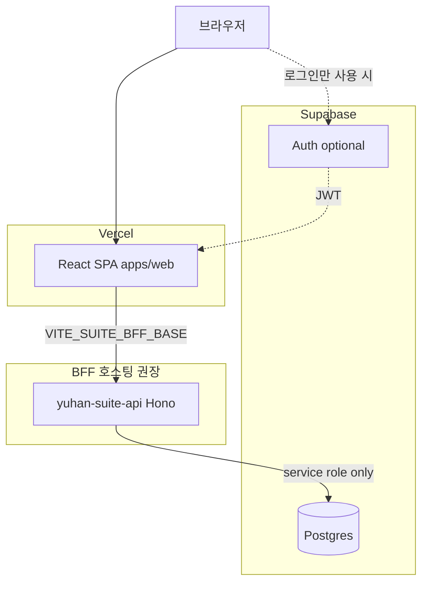

# Supabase · Vercel 배포 가이드 (Yuhan Suite)

## 권장 토폴로지

- **Vercel**: 정적 프론트(`apps/web` 빌드 산출물) 배포. API는 **긴 실행·아웃박스 워커** 때문에 Vercel Serverless만으로 BFF 전체를 옮기기 어렵습니다(워커 `setInterval`, SQLite/연결 풀). **BFF는 컨테이너/VM/항상-on PaaS**(Fly.io, Railway, Render, Cloud Run 등)를 권장합니다.
- **Supabase**: **BFF 전용 Postgres**로 감사·아웃박스·멱등·승인 큐를 저장. 브라우저는 **직접 Postgres에 붙지 않는 것**을 권장(서비스 롤 키는 서버에만).

## Vercel (웹)

1. Root Directory: `apps/web` (또는 모노레포 루트에서 `cd apps/web && npm run build`로 `dist` 지정).
2. Build: `npm ci && npm run build` (워크스페이스면 루트에서 설치 후 `-w web` 빌드).
3. Output: `apps/web/dist`.
4. 환경 변수 (Production / Preview 구분 권장):

| 변수 | 용도 |
|------|------|
| `VITE_SUITE_BFF_BASE` | 공개 BFF URL (예: `https://api.example.com`, **끝에 `/api` 없이** 베이스만 — 클라이언트가 `/api/v1` 붙임) |
| `VITE_SUITE_BFF_JWT` | (선택) 짧은 만료 사용자 JWT — **프로덕션은 사용자별 발급·저장소 비권장** |
| `VITE_SUITE_BFF_ADMIN_KEY` | **프로덕션 비권장** — 관리 UI만 내부망·별도 인증으로 |

5. 라우팅: [`apps/web/vercel.json`](../../apps/web/vercel.json)로 SPA 폴백(`/*` → `index.html`).

로컬 개발은 [`vite.config.ts`](../../apps/web/vite.config.ts)의 `/api` → `127.0.0.1:8787` 프록시를 사용합니다. **프로덕션에서는 프록시 없음** → 반드시 `VITE_SUITE_BFF_BASE`로 실제 API 호스트를 지정합니다.

## Supabase (데이터)

**키·연결 정보 핸드오프**: Yuaimarketing 등 프로젝트 소유 측에서 무엇을 BFF 담당에게 넘겨야 하는지는 [SUPABASE_KEYS_HANDOFF.md](./SUPABASE_KEYS_HANDOFF.md)를 따릅니다. `service_role`·DB URL은 **Vercel 웹 빌드에 넣지 않습니다.**

1. 프로젝트 생성 후 **Connection string** (Transaction, 포트 5432)을 BFF 환경 변수로만 주입.
2. 초기 테이블은 [supabase-schema-draft.sql](./supabase-schema-draft.sql)를 참고해 SQL Editor에서 실행하거나 마이그레이션 도구로 적용.
3. **RLS**: 브라우저가 Supabase 클라이언트로 직접 읽지 않으면, BFF만 접속하는 계정으로 **RLS를 단순 거부 또는 서버 전용 스키마**로 두어도 됩니다. 향후 Edge Function에서 읽을 때는 테넌트별 RLS 정책을 설계합니다.

## BFF 환경 (Supabase 연동 시)

| 변수 (예시) | 설명 |
|-------------|------|
| `BFF_CORS_ORIGINS` | (권장) 쉼표 구분 허용 Origin. 미설정 시 `*` — [SECURITY_IMPROVEMENT_PLAN](./SECURITY_IMPROVEMENT_PLAN.md) Phase B |
| `DATABASE_URL` 또는 `SUPABASE_DB_URL` | Postgres 연결 문자열 (풀러 권장: Supabase pooler) |
| 기존 BFF 변수 | `BFF_API_KEY`, `JWT_SECRET` 또는 Supabase JWT 검증, `BFF_WEBHOOK_SIGNING_SECRET` 등 — [templates/staging.env.example](./templates/staging.env.example) |

**구현 참고**: 현재 BFF는 `better-sqlite3` 기반입니다. Supabase 전환 시 `store/sqlite.ts` 등을 Postgres 드라이버로 교체하는 작업이 필요합니다(별도 개발 이슈).

## Supabase Auth와 BFF

- 사용자 로그인을 Supabase Auth로 할 경우: BFF는 **JWT 검증**을 `JWT_SECRET`(Supabase JWT secret) 또는 **JWKS**(프로젝트 설정에 맞게)로 맞출 수 있습니다. [GATEWAY_OIDC.md](./GATEWAY_OIDC.md), [SECURITY_IMPROVEMENT_PLAN.md](./SECURITY_IMPROVEMENT_PLAN.md) 참고.

## 체크리스트

- [ ] Vercel에 `VITE_SUITE_BFF_BASE` 설정, Preview URL도 BFF CORS에 포함할지 결정
- [ ] BFF 호스트에 TLS 종료(리버스 프록시)
- [ ] Supabase DB 마이그레이션 적용
- [ ] BFF에 DB URL·API 키는 **Vercel이 아닌** BFF 호스팅 쪽 시크릿에만 저장
